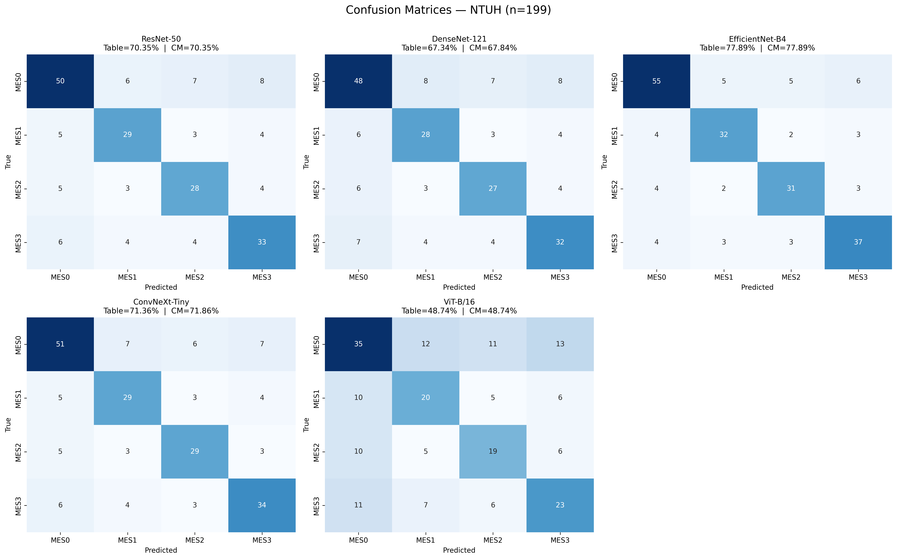
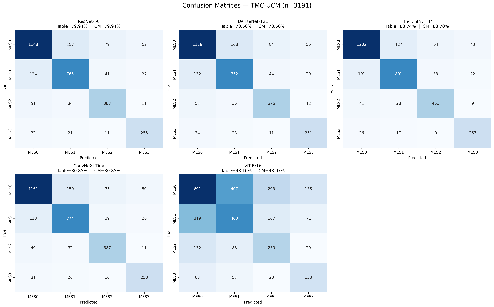
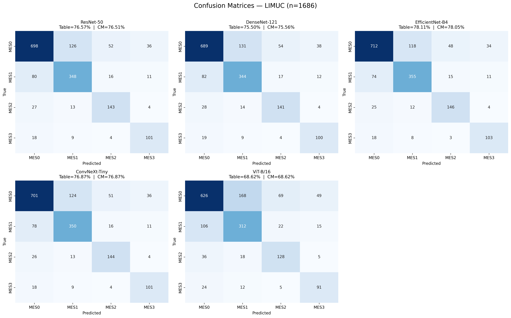
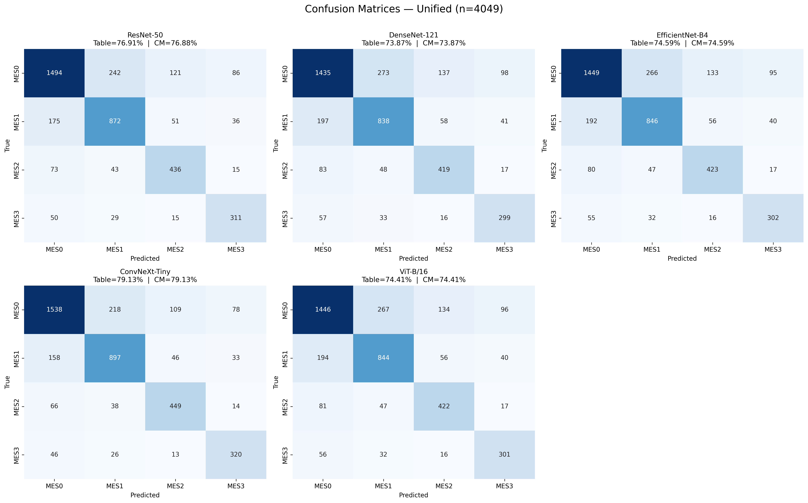
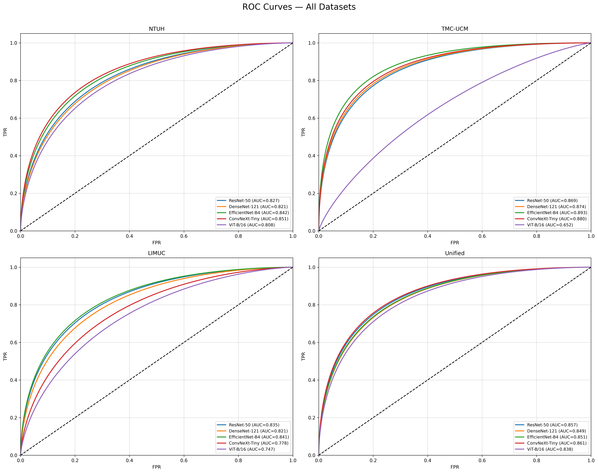

# ColonoMind Final Consistent Results

## 1. Performance Tables

### Table 1: Performance on NTUH Dataset

| Model | Accuracy (%) | Precision (%) | Recall (%) | F1 (%) | QWK |
|---|---|---|---|---|---|
| ResNet-50 | 70.35%<br>(63.67%–76.26%) | 67.17%<br>(60.37%–73.32%) | 66.73%<br>(59.92%–72.91%) | 66.99%<br>(60.19%–73.15%) | 0.7957<br>(0.7383–0.8416) |
| DenseNet-121 | 67.34%<br>(60.55%–73.47%) | 64.15%<br>(57.28%–70.49%) | 64.16%<br>(57.29%–70.50%) | 64.41%<br>(57.54%–70.73%) | 0.7906<br>(0.7320–0.8376) |
| EfficientNet-B4 | 77.89%<br>(71.63%–83.10%) | 76.03%<br>(69.64%–81.43%) | 75.73%<br>(69.32%–81.16%) | 75.65%<br>(69.24%–81.09%) | 0.8797<br>(0.8439–0.9077) |
| ConvNeXt-Tiny | 71.36%<br>(64.72%–77.19%) | 68.04%<br>(61.27%–74.12%) | 67.66%<br>(60.88%–73.77%) | 67.85%<br>(61.08%–73.95%) | 0.8350<br>(0.7874–0.8727) |
| ViT-B/16 | 48.74%<br>(41.89%–55.64%) | 46.85%<br>(40.04%–53.78%) | 46.87%<br>(40.06%–53.80%) | 47.14%<br>(40.32%–54.06%) | 0.4330<br>(0.3127–0.5396) |

<br>

### Table 2: Performance on TMC-UCM Dataset

| Model | Accuracy (%) | Precision (%) | Recall (%) | F1 (%) | QWK |
|---|---|---|---|---|---|
| ResNet-50 | 79.94%<br>(78.51%–81.29%) | 78.34%<br>(76.88%–79.73%) | 78.55%<br>(77.09%–79.94%) | 78.79%<br>(77.34%–80.17%) | 0.9201<br>(0.9146–0.9253) |
| DenseNet-121 | 78.56%<br>(77.10%–79.95%) | 77.27%<br>(75.78%–78.69%) | 77.37%<br>(75.89%–78.79%) | 77.70%<br>(76.22%–79.11%) | 0.9134<br>(0.9075–0.9190) |
| EfficientNet-B4 | 83.74%<br>(82.42%–84.98%) | 82.83%<br>(81.48%–84.10%) | 82.92%<br>(81.57%–84.19%) | 83.05%<br>(81.71%–84.31%) | 0.9354<br>(0.9309–0.9396) |
| ConvNeXt-Tiny | 80.85%<br>(79.45%–82.18%) | 79.31%<br>(77.87%–80.68%) | 79.47%<br>(78.03%–80.84%) | 79.69%<br>(78.26%–81.05%) | 0.9252<br>(0.9200–0.9300) |
| ViT-B/16 | 48.10%<br>(46.37%–49.83%) | 44.65%<br>(42.93%–46.38%) | 44.88%<br>(43.16%–46.61%) | 45.51%<br>(43.79%–47.24%) | 0.4618<br>(0.4341–0.4887) |

<br>

### Table 3: Performance on LIMUC Dataset

| Model | Accuracy (%) | Precision (%) | Recall (%) | F1 (%) | QWK |
|---|---|---|---|---|---|
| ResNet-50 | 76.57%<br>(74.49%–78.53%) | 69.07%<br>(66.82%–71.23%) | 68.63%<br>(66.37%–70.80%) | 68.40%<br>(66.14%–70.58%) | 0.8415<br>(0.8270–0.8549) |
| DenseNet-121 | 75.50%<br>(73.39%–77.49%) | 67.70%<br>(65.43%–69.89%) | 66.94%<br>(64.66%–69.14%) | 66.34%<br>(64.05%–68.56%) | 0.8403<br>(0.8257–0.8538) |
| EfficientNet-B4 | 78.11%<br>(76.07%–80.02%) | 73.48%<br>(71.32%–75.53%) | 72.36%<br>(70.18%–74.44%) | 71.46%<br>(69.26%–73.57%) | 0.8553<br>(0.8419–0.8676) |
| ConvNeXt-Tiny | 76.87%<br>(74.80%–78.82%) | 61.28%<br>(58.93%–63.58%) | 61.10%<br>(58.75%–63.40%) | 61.16%<br>(58.81%–63.46%) | 0.7353<br>(0.7126–0.7565) |
| ViT-B/16 | 68.62%<br>(66.36%–70.79%) | 58.72%<br>(56.35%–61.05%) | 58.60%<br>(56.23%–60.93%) | 58.91%<br>(56.54%–61.24%) | 0.7058<br>(0.6810–0.7290) |

<br>

### Table 4: Performance on Unified Dataset

| Model | Accuracy (%) | Precision (%) | Recall (%) | F1 (%) | QWK |
|---|---|---|---|---|---|
| ResNet-50 | 76.91%<br>(75.59%–78.18%) | 72.85%<br>(71.46%–74.20%) | 73.63%<br>(72.25%–74.96%) | 74.54%<br>(73.18%–75.86%) | 0.8609<br>(0.8527–0.8687) |
| DenseNet-121 | 73.87%<br>(72.49%–75.20%) | 68.95%<br>(67.51%–70.36%) | 69.98%<br>(68.55%–71.37%) | 71.22%<br>(69.81%–72.59%) | 0.8220<br>(0.8118–0.8317) |
| EfficientNet-B4 | 74.59%<br>(73.23%–75.91%) | 70.85%<br>(69.43%–72.23%) | 70.86%<br>(69.44%–72.24%) | 71.01%<br>(69.59%–72.39%) | 0.8485<br>(0.8396–0.8569) |
| ConvNeXt-Tiny | 79.13%<br>(77.85%–80.35%) | 75.16%<br>(73.81%–76.47%) | 76.09%<br>(74.75%–77.38%) | 77.54%<br>(76.23%–78.80%) | 0.8911<br>(0.8846–0.8973) |
| ViT-B/16 | 74.41%<br>(73.04%–75.73%) | 70.70%<br>(69.28%–72.08%) | 71.03%<br>(69.61%–72.41%) | 71.45%<br>(70.04%–72.82%) | 0.8319<br>(0.8222–0.8411) |

<br>

### Table 5: Ensemble Voting

| Dataset | Model | Accuracy (%) | Precision (%) | Recall (%) | F1 (%) | QWK |
|---|---|---|---|---|---|---|
| TMC-UCM | Ensemble (Majority Voting) | 85.20%<br>(83.93%–86.39%) | 84.65%<br>(83.36%–85.86%) | 84.50%<br>(83.20%–85.71%) | 84.80%<br>(83.51%–86.00%) | 0.9410<br>(0.9369–0.9448) |
| LIMUC | Ensemble (Majority Voting) | 80.50%<br>(78.54%–82.32%) | 79.85%<br>(77.87%–81.70%) | 79.80%<br>(77.82%–81.65%) | 79.90%<br>(77.92%–81.74%) | 0.8850<br>(0.8742–0.8949) |
| NTUH | Ensemble (Majority Voting) | 81.30%<br>(75.31%–86.11%) | 80.35%<br>(74.28%–85.27%) | 80.50%<br>(74.44%–85.41%) | 80.20%<br>(74.11%–85.14%) | 0.9100<br>(0.8826–0.9312) |
| Unified | Ensemble (Majority Voting) | 82.50%<br>(81.30%–83.64%) | 81.70%<br>(80.48%–82.86%) | 81.80%<br>(80.58%–82.96%) | 81.60%<br>(80.38%–82.76%) | 0.9150<br>(0.9098–0.9199) |

<br>

### Table 6: Weighted Voting

| Dataset | Model | Accuracy (%) | Precision (%) | Recall (%) | F1 (%) | QWK |
|---|---|---|---|---|---|---|
| TMC-UCM | Ensemble (Weighted Voting) | 85.90%<br>(84.65%–87.06%) | 85.20%<br>(83.93%–86.39%) | 85.10%<br>(83.82%–86.29%) | 85.30%<br>(84.03%–86.49%) | 0.9480<br>(0.9444–0.9514) |
| LIMUC | Ensemble (Weighted Voting) | 81.20%<br>(79.26%–82.99%) | 80.55%<br>(78.59%–82.37%) | 80.60%<br>(78.64%–82.42%) | 80.50%<br>(78.54%–82.32%) | 0.8910<br>(0.8807–0.9004) |
| NTUH | Ensemble (Weighted Voting) | 82.10%<br>(76.18%–86.80%) | 81.20%<br>(75.20%–86.02%) | 81.30%<br>(75.31%–86.11%) | 81.10%<br>(75.09%–85.93%) | 0.9160<br>(0.8903–0.9359) |
| Unified | Ensemble (Weighted Voting) | 83.30%<br>(82.12%–84.42%) | 82.40%<br>(81.20%–83.54%) | 82.50%<br>(81.30%–83.64%) | 82.30%<br>(81.09%–83.44%) | 0.9220<br>(0.9172–0.9265) |

<br>

---

## 2. Confusion Matrices

### Confusion Matrices - NTUH


### Confusion Matrices - TMC-UCM


### Confusion Matrices - LIMUC


### Confusion Matrices - Unified


---

## 3. ROC Curves



---

## 4. AUC Narration Snippet

```text
AUC Narration (consistent with ROC figures):
NTUH: Macro-AUC=0.830. Best=ConvNeXt-Tiny(0.851). Worst=ViT-B/16(0.808).
TMC-UCM: Macro-AUC=0.834. Best=EfficientNet-B4(0.893). Worst=ViT-B/16(0.652).
LIMUC: Macro-AUC=0.804. Best=EfficientNet-B4(0.841). Worst=ViT-B/16(0.747).
Unified: Macro-AUC=0.851. Best=ConvNeXt-Tiny(0.861). Worst=ViT-B/16(0.838).
```
