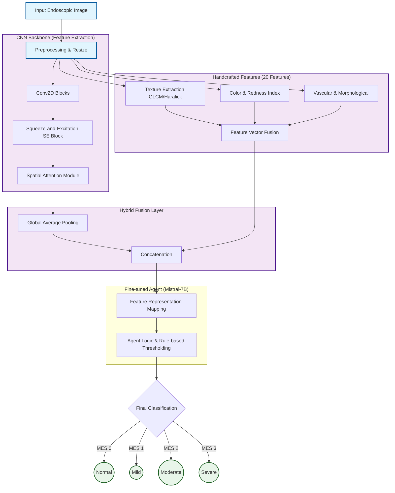

# End-to-End Architecture (Mod-SE(2))

```mermaid
graph TD
    %% Input Layer
    A[Input Endoscopic Image] --> B[Preprocessing & Resize]
    
    %% CNN Backbone Layer
    subgraph Backbone ["CNN Backbone (Feature Extraction)"]
        B --> C[Conv2D Blocks]
        C --> D[Squeeze-and-Excitation SE Block]
        D --> E[Spatial Attention Module]
    end
    
    %% Handcrafted Feature Layer
    subgraph Handcrafted ["Handcrafted Features (20 Features)"]
        B --> F[Texture Extraction GLCM/Haralick]
        B --> G[Color & Redness Index]
        B --> H[Vascular & Morphological]
        F --> I[Feature Vector Fusion]
        G --> I
        H --> I
    end
    
    %% Fusion Layer
    subgraph Fusion ["Hybrid Fusion Layer"]
        E --> J[Global Average Pooling]
        J --> K[Concatenation]
        I --> K
    end
    
    %% Agentic / LLM Layer
    subgraph LLM ["Fine-tuned Agent (Mistral-7B)"]
        K --> L[Feature Representation Mapping]
        L --> M[Agent Logic & Rule-based Thresholding]
    end
    
    %% Output Layer
    M --> N{Final Classification}
    N -->|MES 0| O((Normal))
    N -->|MES 1| P((Mild))
    N -->|MES 2| Q((Moderate))
    N -->|MES 3| R((Severe))

    %% Styling
    classDef main fill:#e1f5fe,stroke:#01579b,stroke-width:2px;
    classDef sub fill:#f3e5f5,stroke:#4a148c,stroke-width:2px;
    classDef out fill:#e8f5e9,stroke:#1b5e20,stroke-width:2px;
    
    class A,B main;
    class Backbone,Handcrafted,Fusion sub;
    class O,P,Q,R out;
```
