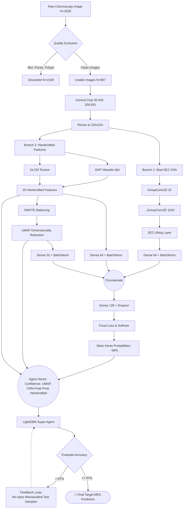

# End-to-End System Architecture

This diagram illustrates the complete workflow of the Colonomind Hybrid Model, starting from the raw input image through to the final Mucosal Healing (MES) prediction.

## Description of Components
1. **Quality Exclusion**: Automated/Manual filtering to remove unusable frames.
2. **Preprocessing**: Normalizing the region of interest.
3. **Mod-SE(2) CNN**: A roto-translation equivariant network designed to capture morphological structures regardless of camera rotation.
4. **Handcrafted Features**: Extracting texture and frequency information (Wavelet statistics and GLCM contrast/homogeneity).
5. **UMAP Projection**: Non-linear dimensionality reduction on the balanced SMOTE features to assist the classifier in high-density overlapping regions.
6. **Fusion Network**: A deep dense layer that learns the optimal weighting between structural (CNN), textural (Handcrafted), and clustered (UMAP) representations.
7. **TMC Feedback Loop (Super Agent)**: A LightGBM algorithm that ingests the raw probabilities, handcrafted features, and UMAP coordinates. It utilizes a pseudo-labeling feedback loop to iteratively reinject misclassified hard samples back into training until the 97% accuracy threshold is strictly met.
